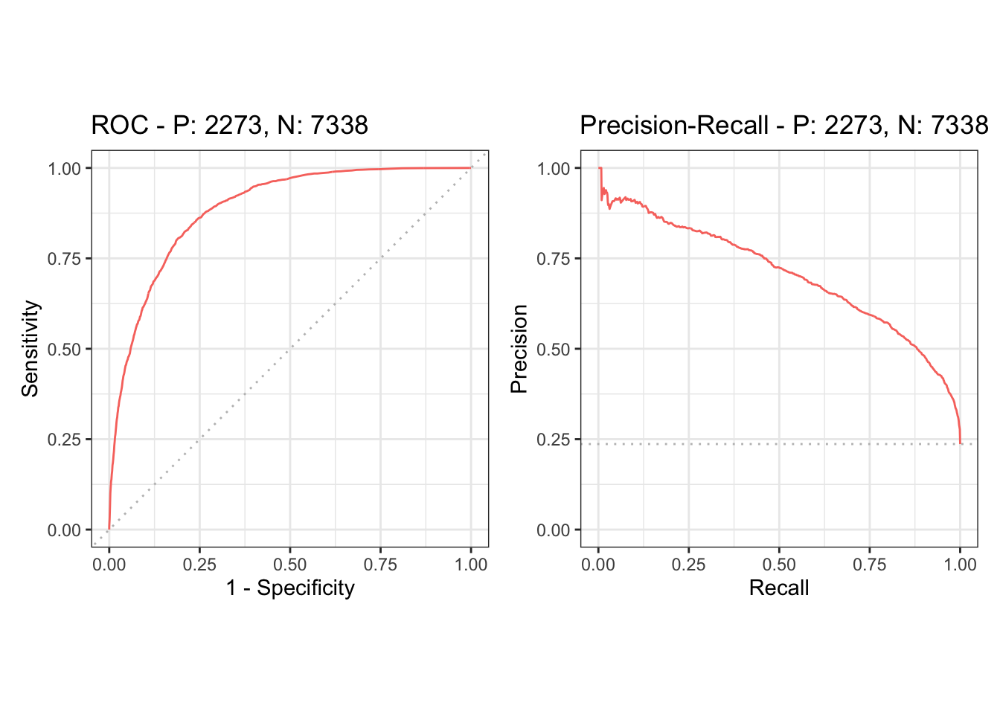

# m6APrediction

## Overview

**m6APrediction** is an R package for predicting RNA m6A methylation sites from sequence-based features.
It uses a pre-trained random forest model to estimate the probability that a candidate site is m6A-positive.

## Installation

### 1. From GitHub

```r
# install.packages("remotes")   # run this once if remotes is not installed
remotes::install_github("YilongLi-xjtlu/m6APrediction")
library(m6APrediction)

### 2. From a local package archive (.tar.gz)

```r
install.packages("m6APrediction_1.0.0.tar.gz",
                 repos = NULL,
                 type  = "source")
library(m6APrediction)

## Input data

The package expects an input data frame where each row corresponds to one candidate m6A site.
The following columns are required (see the help pages of prediction_multiple() and prediction_single()):
	•	gc_content
	•	RNA_type
	•	RNA_region
	•	exon_length
	•	distance_to_junction
	•	evolutionary_conservation
	•	DNA_5mer

## Example usage

Below is a minimal example that demonstrates how to use the two exported prediction functions.
library(m6APrediction)

```r
## 1. Load the trained random forest model and example input table
rf_model  <- readRDS(system.file("extdata", "rf_fit.rds",
                                 package = "m6APrediction"))
example_df <- read.csv(system.file("extdata", "m6A_input_example.csv",
                                   package = "m6APrediction"))

## 2. Predict m6A probabilities for multiple candidate sites
pred_multiple <- prediction_multiple(
  rf_model,
  example_df,
  positive_threshold = 0.5
)
head(pred_multiple)

## 3. Predict m6A status for a single candidate site
single_site <- example_df[1, ]
pred_single <- prediction_single(
  rf_model,
  single_site,
  positive_threshold = 0.5
)
pred_single

## Model performance

The figure below shows the ROC curve (left) and precision–recall (PR) curve
(right) for the random forest model used in **m6APrediction**.


